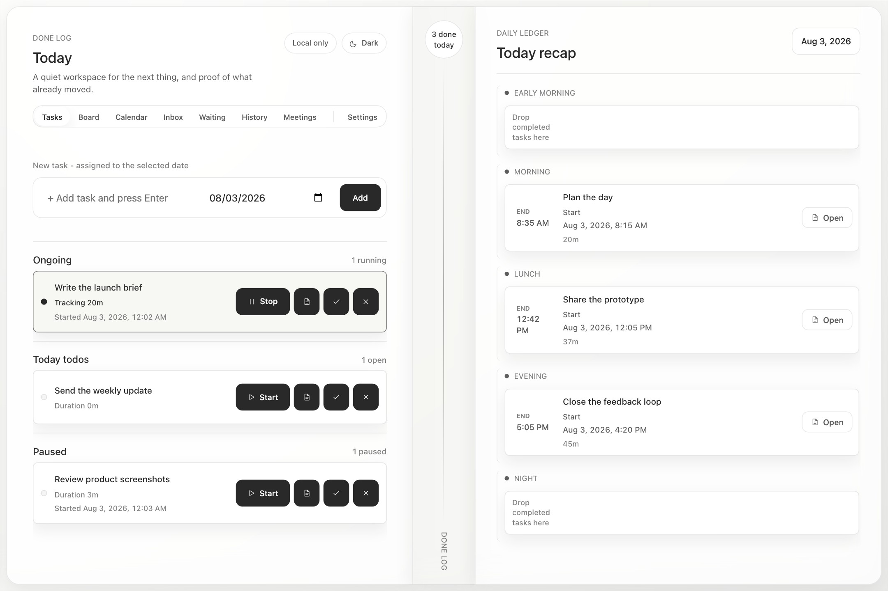
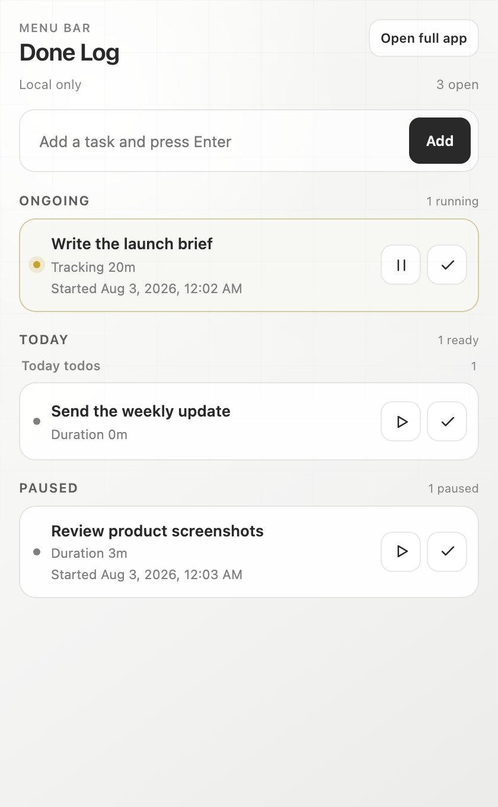

# Done Log

A quiet task tracker that keeps what is next beside proof of what got done.

[Open Done Log](https://tony-todo-app.vercel.app)



## What it does

- Captures open work in a focused daily queue.
- Tracks time across start, pause, and resume.
- Turns completed work into a time-of-day recap.
- Keeps task notes, checklists, history, and due dates together.
- Brings the same workflow to the macOS menu bar.
- Opens the complete workflow in a standard native macOS window with move, resize, minimize, zoom, full-screen, menus, and keyboard shortcuts.

<p align="center">
  
</p>

## Run locally

```bash
npm install
npm run dev
```

Open the local URL with `?local=1` to use browser storage without an account.

Optional cloud sync is configured through a local `.env.local` copied from [.env.example](.env.example).
Never commit environment files or credentials.

## macOS app and menu bar

```bash
npm run menubar:install
```

See [the menu bar guide](docs/menubar-companion.md) for development and verification commands.

## Verify

```bash
npm test
npm run build
npm run test:menubar
npm run test:native-menubar
```
